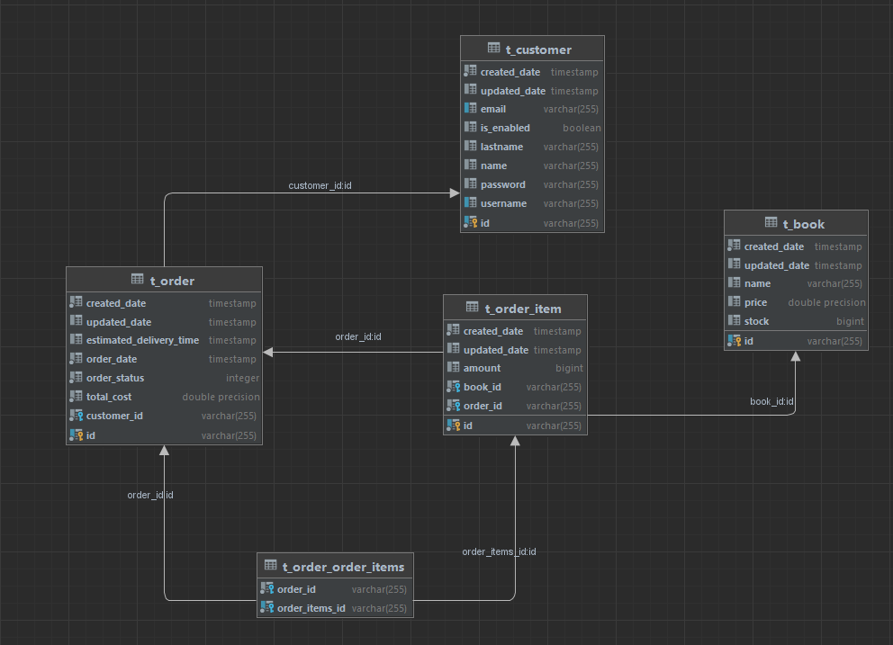

# Getir Bir Mutluluk
## Every time reading is good


ReadingIsGood Spring Boot application is a demo project that sailing the books exist on the system. 
There are some endpoints that adding book, registering as a new customer, ordering books, getting statistics etc.


## Tech Stack
- JDK:17
- Spring Boot
- Spring Data JPA
- Postgre SQL


## Database Design




## Requirements
- JDK:17
- PostgreSQL (if you don't want to run docker containers. Please change the configuration on the application.yml files.)
- Docker Deamon


## Running application with Docker


```shell
mvn clean package
```

If you want to create the image and containers every time start you can use.

```shell
docker-compose up --build
```

> Spring Boot Application will work on :8090 port.


After successfully run the application please reach to the postman collection that given following link.

https://www.postman.com/gaga-commerce/workspace/aytekin-public-workspace/collection/4224227-585db43d-0f3a-4b02-b22a-4a3e1699a823?action=share&creator=4224227

 - First of all please create a new customer.
 - Login the credentials that your created customer and get access token.
 - Set the returned access token to the token variable in the environment.

## Created By Aytekin Erlale